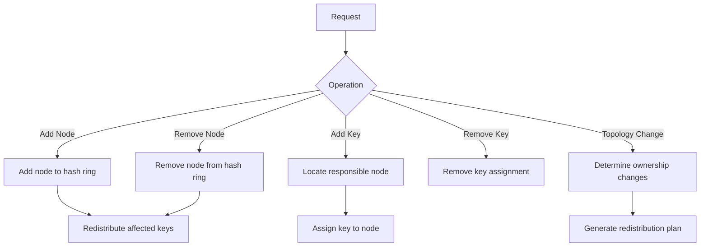
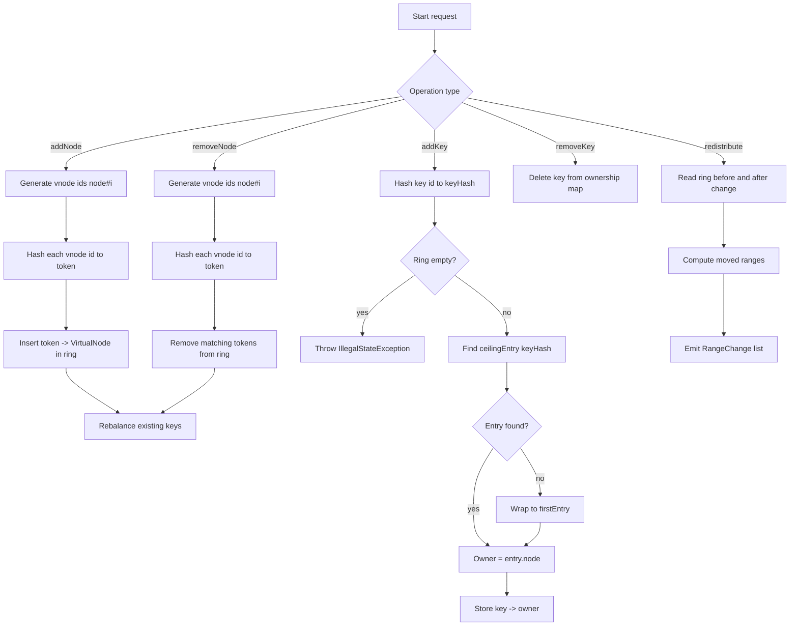

# README

This is the repository for a consistent hashing implementation written in Java. To compile and run in `macOS`:

```bash
# install Java and just utility
brew install openjdk just

# install dependencies
just install

# compile and run the server
just run
```

## Architecture




